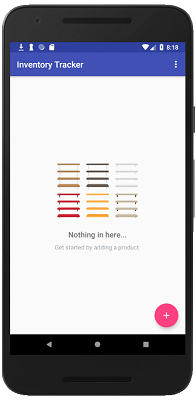
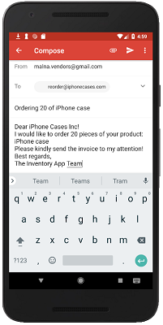

## Inventory Tracker App  

### Features  

This app was made as the final project for the Udacity Android Basics: Data Storage course.  

The app stores and retrieves inventory items in a SQLite database.  

When opening the app, empty shelves greet the user. The user can insert dummy data or add a new product by clicking the "+" Floating Action Button.  

    

When adding a new product, the user has to fill in inventory information about the product, such as name, supplier, supplier email address, available 
quantity. The user can also attach an image. By clicking the "UPLOAD" button, an intent is sent and the gallery launches. If the user tries to save the
product without filling in some of the required information, a toast message alerts the user.  

    

The catalog screen lists all the products and information about their price and available quantity. By clicking the "SOLD 1" button, the quantity
gets decreased by one, and the inventory information changes in the database as well. By clicking one of the items, the product editor opens, where 
the extended product information loads, and the user can modify the details. If the user wants to reorder, then they can write in the quantity to order
in the order more field, and click the "ORDER MORE" button. This launches an intent and opens an email application with a pre-populated text.  

    

The user can also delete the product. Before allowing them to do so, a delete confirmation dialog opens.  

   

### Technical notes  

On the technical side, the app uses an SQLiteOpenHelper to create the database, a ContentProvider to interact with the database, and a CursorAdapter
to load the data into a ListView. Both the Editor and the Catalog Activity load the data asynchronously with the help of Loaders.

